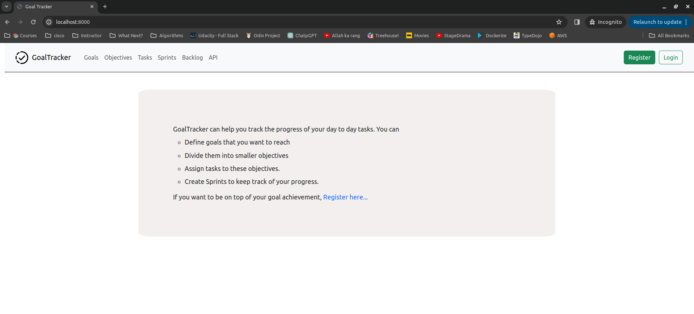
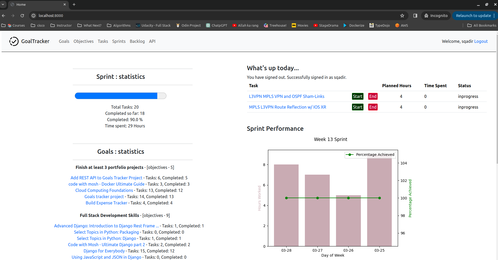

# Personal Goal Tracker

## Introduction

A Django app developed to track goals, objectives, and tasks related to them.

The workflow is like you create a goal, assign objectives to it. Then create Sprint and assign task to it. 

Has API Support developed using Django Rest Framework (DRF).

## Walkthrough - how it works



Once registered, and logged in, you will get following screen. Below is my home screen where it tells me how far I am on current sprint, how it compares with last few sprints, what goals I have defined and what is their status.



## Installation

Clone repository

```
git clone https://github.com/shahzadqadir/personal_tracker_v2.git

Change directory 
cd personal_tracker_v2
```

If you have docker installed then you don't need anything else, just run docker compose file, you may need sudo access (depending on how you have installed docker).

```
sudo docker compose up --build
```

Then open browser and go to ``localhost:8000``

### Known Issues

If you come across following error

```
personal_tracker_v2-web-1  | django.db.utils.ProgrammingError: relation "userauth_customuser" does not exist

```

That means database/tables are not propery created. Please open a second tab and run following command

```
sudo docker compose exec -T db psql -U postgres -d postgres < database_dump.sql

Once completed, run migration

sudo docker compose exec web python manage.py migrate
```

Stop and start docker containers again

```
On main window Ctrl+C 
sudo docker compose down
sudo docker compose up
```
